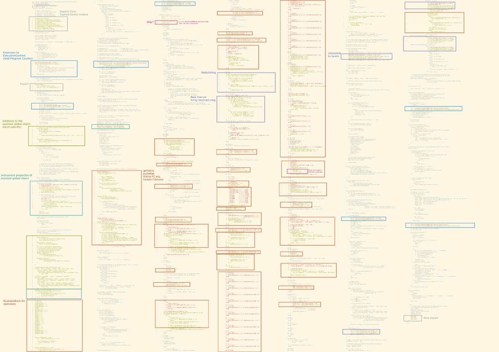

% Étendre des interpréteurs par détournement   ou   Comment étendre des interpréteurs sans en modifier le code
% fmdkdd
% Mines Nantes, 18 novembre 2016

# Préliminaires

## Le cycle de vie d'un programme

## De la spécification au processus

<video src="img/visual-6502.mp4" style="width:62%">

- ECMA6: 566 pages

# Le problème

## Modifier l'interpréteur

---

---

## Détourner l'interpréteur

# Construire un interpréteur par modules

## Utiliser `with`

# Étendre Narcissus par manipulation de portée

## Ouvrir le motif module

